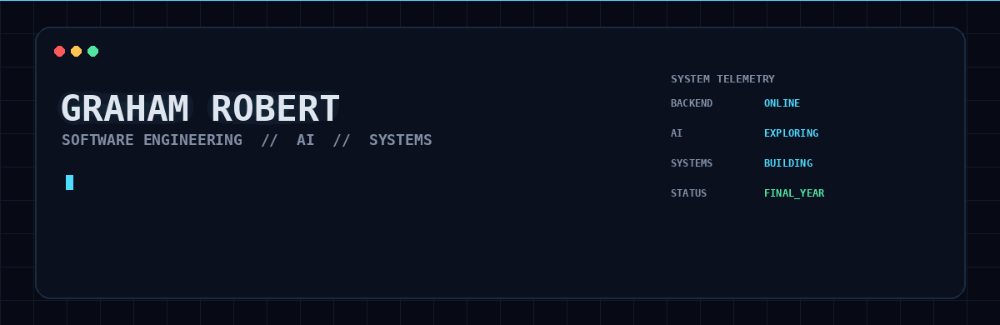
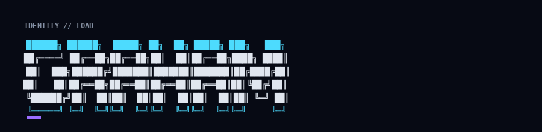
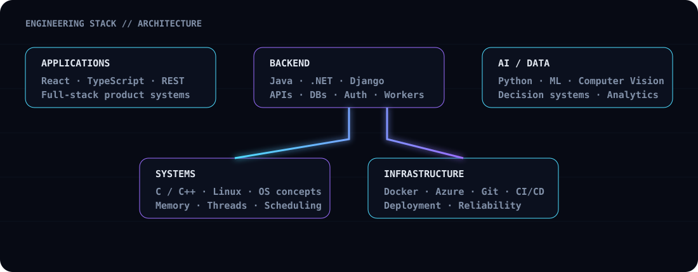
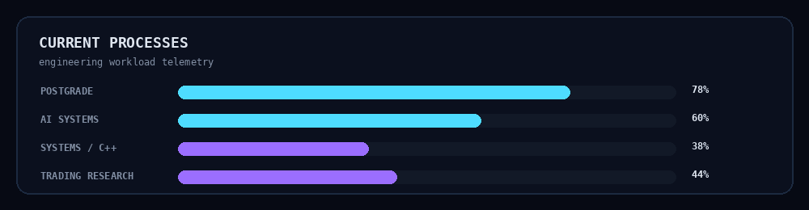

<div align="center">



<br>



<p>
  <a href="https://github.com/lSiphonl">
    
  </a>
  
  
</p>

<h3>Building software because I genuinely enjoy engineering it.</h3>

<p>
I’m a final-year Software Engineering student at North-West University,
interested in backend development, AI, systems engineering, and the engineering
behind software that actually has to work.
</p>

</div>

---

## `~/about`

```text
NAME        Graham Robert
ROLE        Final-year Software Engineering student
UNIVERSITY  North-West University
FOCUS       Backend Engineering / AI / Systems
MINDSET     Understand it → Build it → Break it → Improve it
```

I work from a place of **passion for software and engineering**. I like understanding what is happening underneath the abstraction, then turning that understanding into practical systems.

My interests sit at the intersection of:

- backend architecture and APIs
- databases and distributed application logic
- AI / machine learning / computer vision
- C/C++ and systems programming
- operating systems and low-level concepts
- cloud, containers and deployment
- data-driven engineering

---

## `~/architecture`



---

## `~/stack`

### Languages

<p>

</p>

### Backend / Web

<p>

</p>

### Data / Infrastructure

<p>

</p>

---

## `~/current_processes`



---

## `~/projects`

### `POSTGRADE`

**Digital marked-assessment delivery platform**

A university-focused system designed around the workflow of lecturers uploading marked scripts, identifying the associated student, and securely making returned assessments available digitally.

**Stack:** React · TypeScript · Tailwind · Django/.NET · PostgreSQL · Python · OpenCV · Docker · Azure

---

### `OPSPULSE`

**Operational intelligence platform**

A project concept focused on turning operational data into actionable information through APIs, analytics, dashboards and intelligent processing.

**Focus:** Backend architecture · Data engineering · Analytics · AI

---

### `GRIDMIND`

**Intelligent infrastructure / decision-support concept**

A data-driven system exploring how software can combine historical information, live inputs and predictive models to support operational decisions.

**Focus:** AI · Data · Backend systems · Decision support

---

### `DATASENTINEL`

**Automated data-quality and anomaly detection concept**

A system designed around detecting unusual, inconsistent or potentially problematic data before it propagates through downstream systems.

**Focus:** Data engineering · ML · APIs · Reliability

---

## `~/engineering-philosophy`

```text
┌─────────────────────────────────────────────────────────┐
│                                                         │
│  DON'T JUST USE THE ABSTRACTION.                       │
│  UNDERSTAND THE ABSTRACTION.                           │
│                                                         │
│  Don't just call an API.                               │
│  Understand the system behind it.                     │
│                                                         │
│  Don't just train a model.                             │
│  Understand the data feeding it.                       │
│                                                         │
│  Don't just write code that works.                     │
│  Build code you can explain.                            │
│                                                         │
└─────────────────────────────────────────────────────────┘
```

---

## `~/github`

<div align="center">


<br>


</div>

---

## `~/activity`

```text
┌─────────────────────────────────────────────────────────┐
│                                                         │
│   ████████████████████████████████████████████████    │
│   █     BUILDING > LEARNING > REFACTORING > REPEAT    █ │
│   ████████████████████████████████████████████████    │
│                                                         │
│   The goal isn't to know every technology.             │
│   The goal is to become dangerous at learning one.     │
│                                                         │
└─────────────────────────────────────────────────────────┘
```

<div align="center">

<a href="https://github.com/lSiphonl?tab=repositories">

</a>

</div>

---

## `~/contact`

<div align="center">

<a href="https://github.com/lSiphonl">

</a>

</div>

<br>

<div align="center">

```text
────────────────────────────────────────────────────────────
                    EXCELLENCE WITHOUT EXCEPTION
────────────────────────────────────────────────────────────
```

</div>

note to viewer: this is a work in progress and i'm figuring it out as i go, but the idea is there and a will to reach the goal is too :)
